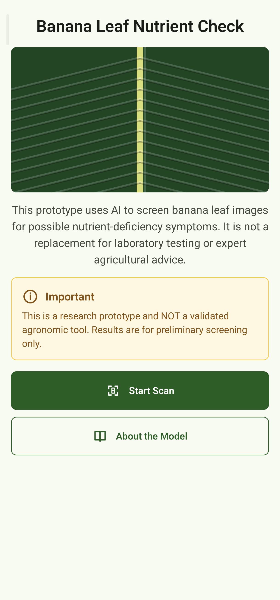
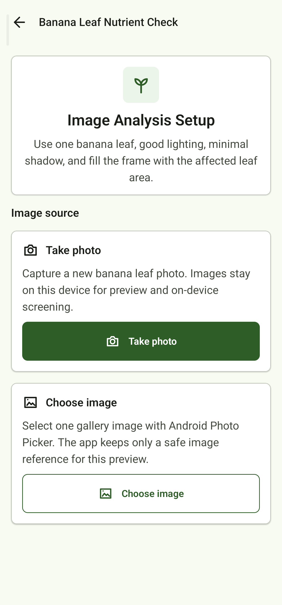
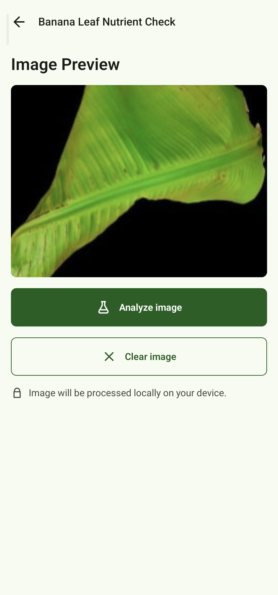
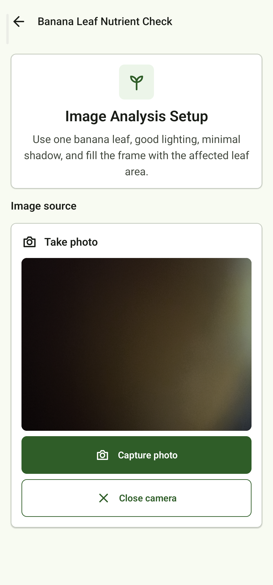
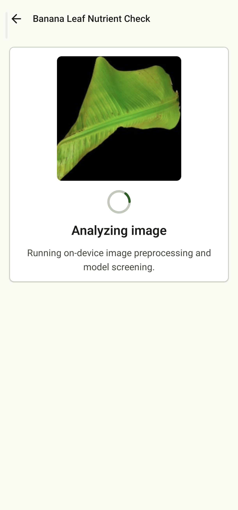
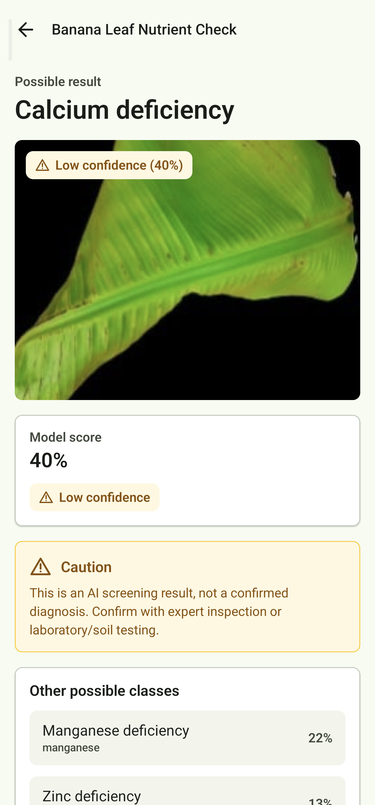
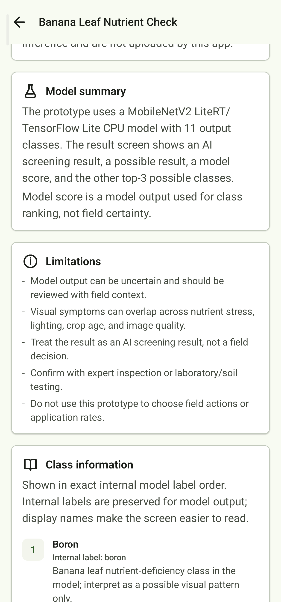
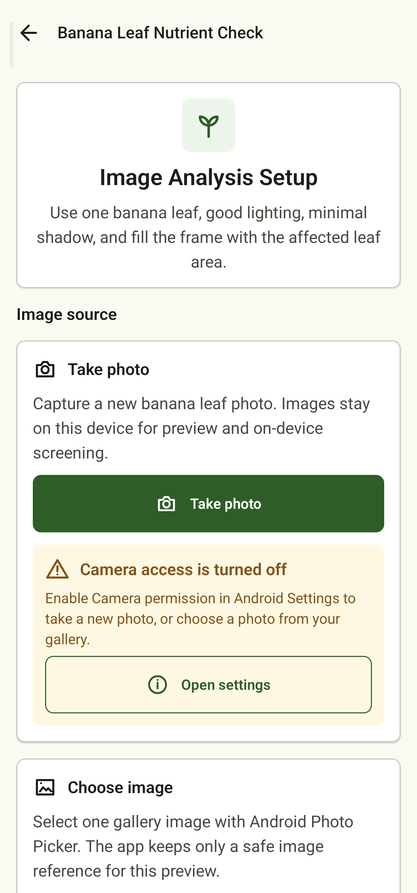

# Banana Leaf Nutrient Check

Android classroom/research prototype for preliminary, on-device banana leaf nutrient-deficiency image screening.

**GitHub short description recommendation:** Offline Android prototype for preliminary on-device banana leaf nutrient-deficiency screening with CameraX, Photo Picker, and top-3 LiteRT results.

## Screenshots

| Home | Scan | Gallery preview | Camera preview |
|---|---|---|---|
|  |  |  |  |

| Analyzing | Result | About limitations | Camera denied |
|---|---|---|---|
|  |  |  |  |

## What The App Does

Banana Leaf Nutrient Check lets a user choose or capture a banana leaf image, previews the image, runs a MobileNetV2 LiteRT/TensorFlow Lite classifier on the Android device, and shows a preliminary AI screening result with a top result, model score, and other top-3 possible classes.

This is a classroom/research prototype only. It is not a validated agronomic diagnostic product, not a confirmed diagnosis, and not a replacement for expert inspection or laboratory/soil testing. It does not provide fertilizer dosage.

## Features

- CameraX still-image capture.
- Android Photo Picker gallery selection.
- Image preview before analysis.
- On-device LiteRT/TensorFlow Lite CPU inference.
- Preliminary top result and top-3 result display.
- Result warnings and limitations that keep uncertainty visible.
- Offline/no-upload behavior.

## Tech Stack

- Kotlin
- Jetpack Compose
- Material 3
- CameraX
- Android Photo Picker
- LiteRT/TensorFlow Lite CPU
- MobileNetV2

## Model Classes

The model label order is preserved exactly:

1. boron
2. calcium
3. healthy
4. iron
5. magnesium
6. manganese
7. nitrogen
8. phosphorous
9. potassium
10. sulphur
11. zinc

Nitrogen and phosphorous are supplemental maize-derived classes and are not banana-validated classes.

## Model Metrics

Source-of-truth project docs report these MobileNetV2 metrics:

- Test accuracy: 57.02%
- Macro F1: 51.84%
- Banana-only macro F1: 44.78%

Model scores are classifier outputs used for ranking, not field certainty.

## Safety And Limitations

- Classroom/research prototype only.
- Not a confirmed diagnosis.
- Not a replacement for expert inspection or laboratory/soil testing.
- No fertilizer dosage or treatment recommendation.
- Nitrogen and phosphorous are maize-derived supplemental classes.
- The model is not field-validated.
- Real-world image quality, lighting, crop age, variety, and overlapping symptoms can affect results.

## Privacy

- Inference runs on-device.
- Images are not uploaded by this app.
- There is no server component.
- Android Photo Picker is used for normal gallery selection, so broad storage permission is not requested.
- Camera captures are stored in app-private cache for preview and on-device screening.
- The current source and debug merged manifest scans confirm no `INTERNET` permission.

## Installation

Download the APK from GitHub Releases. Because this is a classroom/prototype APK outside the Play Store, Android may ask you to enable **Install unknown apps** for the browser or file manager used to open it.

Recommended release title:

```text
Banana Leaf Nutrient Check Prototype APK
```

Recommended release note:

```text
Classroom/research prototype APK for offline preliminary banana leaf nutrient classification. Not a validated diagnostic tool and not intended for fertilizer recommendations.
```

## Build From Source

Requirements:

- Android Studio
- Android SDK
- JDK 17-compatible toolchain

Build the debug APK:

```powershell
.\gradlew.bat :app:assembleDebug
```

The debug APK is generated at:

```text
app/build/outputs/apk/debug/app-debug.apk
```
